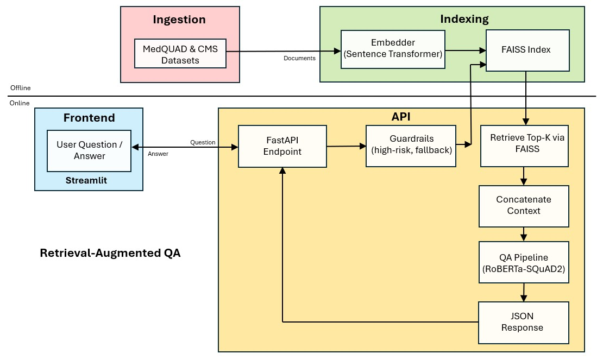

# Healthcare Conversational Assistant

## 1. What is the project about?

MedGuide-AI is an intelligent web-based assistant that answers medical questions related to symptoms, conditions, and insurance using a Retrieval-Augmented Generation (RAG) pipeline built on top of transformer models. It is designed to be informative, intuitive, and safe, integrating guardrails to avoid risky medical advice. It helps users:

- Understand medical symptoms (e.g. “What are signs of stroke?”)  
- Navigate insurance policies (e.g. “How do I appeal a denied claim?”)  
- Get concise, source-grounded answers with safety guardrails for medical or high-risk queries  

## 2. What are we trying to achieve?

- Provide accurate medical information using a hybrid NLP pipeline
- Make healthcare information accessible, conversational, and safe
- Explore the boundaries between **extractive QA** and **generative QA**, with future support for GPT-style completions
- **Accuracy & Explainability**: Answers are extracted directly from trusted source documents (MedQuAD Q&A, CMS policy PDFs) and each response lists its sources.  
- **Safety & Compliance**: High-risk requests (diagnosis, treatment, dosing) trigger a professional-referral disclaimer; low-confidence answers fall back to a “not certain” message.  
- **Zero-Cost & Open Source**: Uses only open-source components and free-tier hosting (Streamlit Community Cloud, Replit, Google Colab).  
- **Reproducibility & Extensibility**: Fully containerized code, clear instructions, and modular pipeline for easy extension to new domains.

## 3. Tools & Libraries used

| Tool/Library              | Purpose                                    |
|---------------------------|--------------------------------------------|
| Streamlit, requests       | Frontend UI for chat interaction           |
| FastAPI                   | Backend API for answering questions        |
| SentenceTransformers      | Embedding generation (biomedical-specific) |
| Transformers              | QA pipeline with RoBERTa (extractive)      |
| FAISS                     | Vector search and similarity retrieval     |
| LangChain                 | Document splitting and chaining logic      |
| PyPDFLoader               | PDF parsing into text chunks               |
| NumPy, pandas             | Preprocessing and I/O                      |
| Replit                    | Hosting backend                            |
| Streamlit Community Cloud | Hosting frontend                           |


## 4. Dataset used

- **MedQuAD**: MedQuAD: Public-domain medical Q&A pairs from trusted institutions. Curated ~16,000 entries, cleaned and filtered by topic to align with target user needs. 
- **CMS Policy PDFs**: Official U.S. government Medicare documentation. Parsed and chunked to assist with insurance-related queries.

## 5. Architecture Diagram



## 6. If I were to reproduce it, how would I?

1. **Clone the repository**  
   ```bash
   git clone https://github.com/your-repo/MedGuide-AI.git
   cd MedGuide-AI
   ```

2. **Install dependencies**  
   ```bash
   pip install -r requirements.txt
   ```

3. **Organize your data**

4. **Run the backend**  
   ```bash
   uvicorn app.api:app --reload
   ```

5. **Run the frontend**
   ```bash
   cd frontend
   streamlit run streamlit_app.py
   ```

## 7. Future Work

- **Enable Generative QA Mode**: Using LLaMA, GPT-3.5 or similar.
- **User session memory**: Across refreshes.
- **Logging & Monitoring**: Integrate Google Sheets or Firebase, set up Sentry, build usage dashboard.  
- **Testing & Feedback**: Automated pytest suite, user feedback widget, iterative prompt refinement.  
- **Maintenance & Scale-Up**: Scheduled data refresh, model/index upgrades, personalization, compliance logging.

